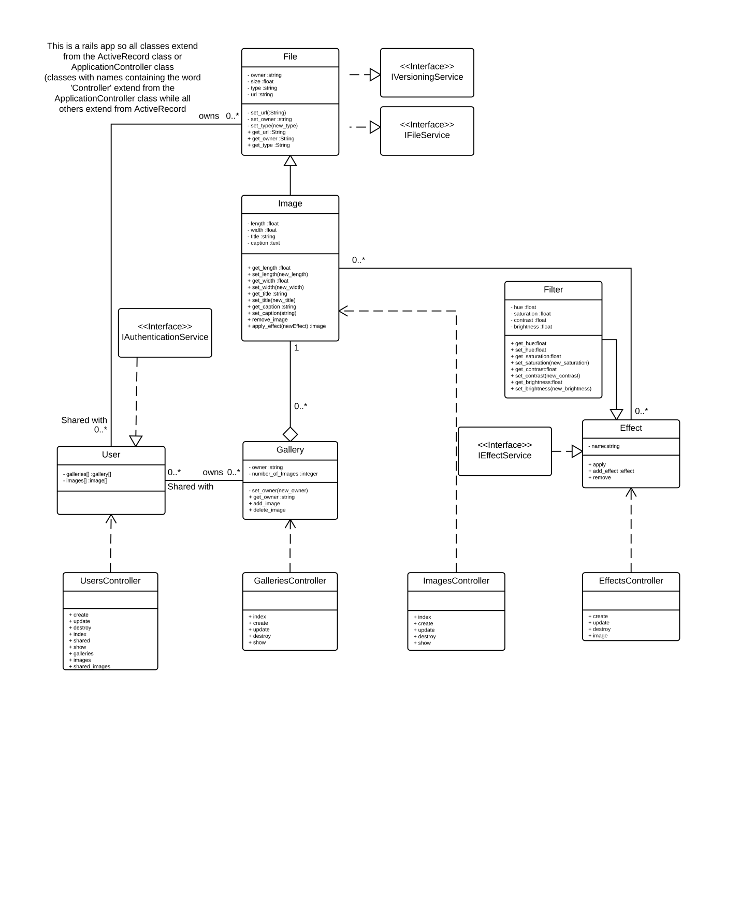

# README #

This README documents the normal steps to get the MediaMajik app running.

1. Navigate to the app directory in terminal.
2. Enter command ```rails s``` to start the webserver on your localhost (the default port is 3000).
3. Navigate to localhost:3000 on your browser to see the app running on the default port.

### What is this repository for? ###

* Quick summary: This app is made as part of project 2 of the Software Modelling and Design class taught at the University of Melbourne
* Version: 0.0.0

### Todos ###

* ~~Finish off adding the components in the class diagram to the app~~.
* ~~Add ability to upload images~~
* ~Add ability to apply filter to images~
* ~Add authentication.~
* Add versioning, either with paper-trail or using carrierwave.
* Add sharing.
* ~~Add galleries~~.

### Notes ###
* Changed the structure of the app from what is listed in the class diagram:
	+ Got rid of the File->Image inheritance and just made them one class for simplicity.
	+ Got rid of the Effect->Filter inheritance and just made them one class for simplicity.

### Class Diagram ###


